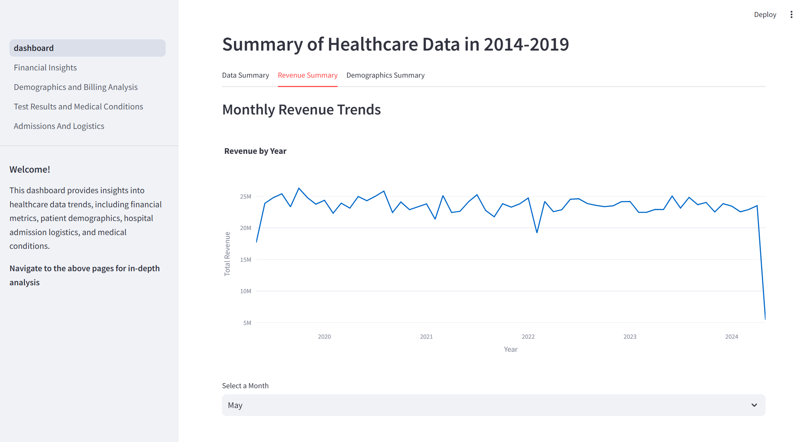
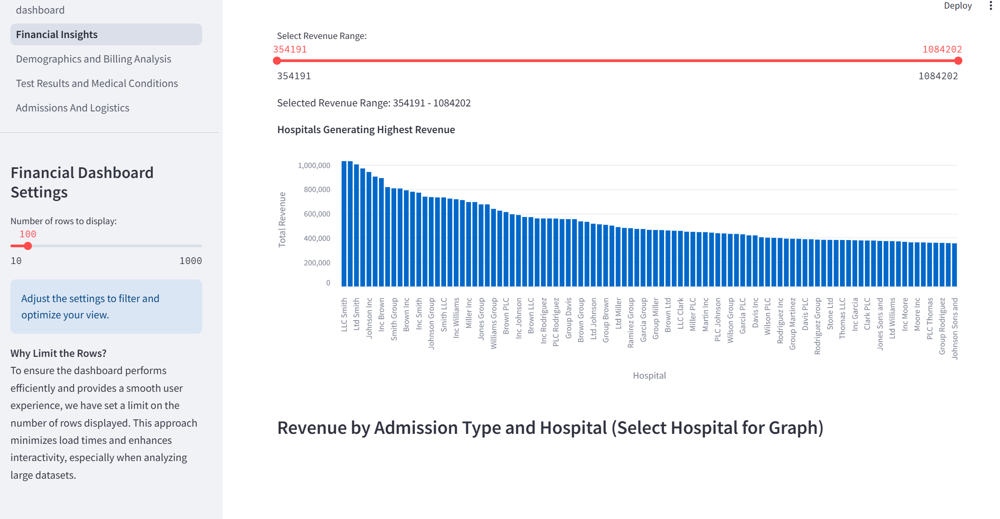
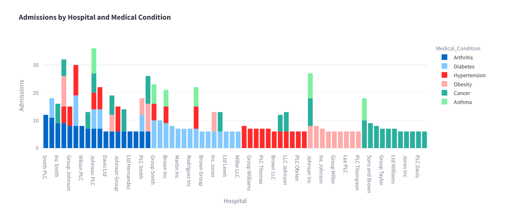

# Healthcare Analytics Dashboard  
📊 SQL + Streamlit Dashboard for Healthcare Data Analysis  

## Overview  
This project analyzes **real-world healthcare data** using SQL and Python, visualized in an interactive Streamlit dashboard.  
It aims to identify trends in patient admissions, hospital revenue, test results, and patient demographics** to improve decision-making in healthcare settings.

### **Key Features**  
✔️ **Data Cleaning & Wrangling** – Removed missing values, structured dataset for analysis.  
✔️ **SQLite Database Integration** – All data is stored and retrieved using SQL queries.  
✔️ **Streamlit Dashboard** – Interactive and user-friendly data visualization tool.  
✔️ **Dynamic Insights** – Data updates automatically when new records are added.  

---

## Problem Statement  
### **Why This Project?**  
Healthcare providers collect vast amounts of patient and hospital data, but many hospitals lack the tools to efficiently analyze and interpret this data.  
This dashboard bridges the gap by turning raw data into actionable insights.

### **Business Objectives**  
- Optimize hospital operations by understanding admission and length-of-stay trends.  
- Increase revenue insights by analyzing billing data and insurance trends.  
- Improve patient care by identifying common medical conditions and test result trends.  

---

## **Dashboard Structure & Insights**  
The dashboard consists of five main sections, each containing multiple tabs for detailed analysis.  

- Main Page: Summary & Trends
- Financial Insights 
- Demographics & Billing Analysis
- Test Results & Medical Conditions
- Admissions & Hospital Logistics





---

## **Getting Started**
1. **Clone the repository:**
   ```bash
   git clone https://github.com/TinaGrkovic/healthcare_dashboard.git
   cd healthcare_dashboard
2. **Run the Streamlit dashboard:**
   ```bash
   streamlit run dashboard.py

### **Repository Structure**
  ```bash
  healthcare_dashboard/
   ├── images/                          # Screenshots
   ├── pages/                           # Additional Streamlit pages
   │   └── (individual page scripts)
   ├── Clean_Healthcare_Dataset.csv     # Cleaned healthcare dataset used for analysis
   ├── healthcare_database.db           # SQLite database for backend storage
   ├── dashboard.py                     # Main Streamlit dashboard
   └── README.md
